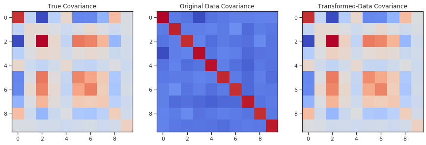
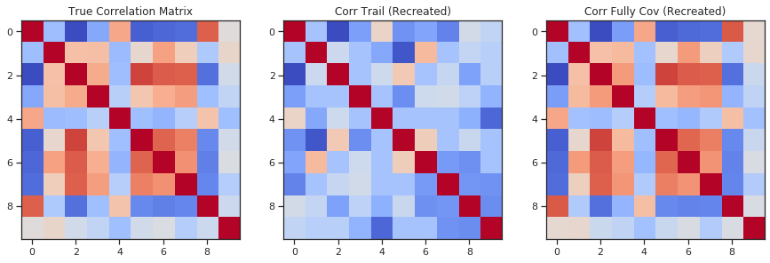

```python
# Import common packages
import numpy as np
import matplotlib.pyplot as plt
import pandas as pd
from sklearn.datasets import make_spd_matrix

# import correlation trail utilities
from generate_corr_variables import match_cov, cov_to_r
from pcorr_explore import rand_hyp, spcorr, cov_hyp_from_corr, cov_trail, plot_mat
```


```python
X = np.random.random((1000, 10))
C_true = make_spd_matrix(10)
X_matched = match_cov(X.T, C_true)
fig, ax = plt.subplots(1,3, figsize=(15, 10))
ax[0].imshow(C_true, cmap='coolwarm')
ax[0].title.set_text('True Covariance')
ax[1].imshow(np.cov(X.T), cmap='coolwarm')
ax[1].title.set_text('Original Data Covariance')
ax[2].imshow(np.cov(match_cov(X.T, C_true)), cmap='coolwarm')
ax[2].title.set_text('Transformed-Data Covariance')
```





```python
cols = [f'x{i}' for i in range(10)]
cov_hyp = cov_trail(df, cols, {i:[j for j in cols if i != j] for i in cols})[0]
df = pd.DataFrame(X_matched.T, columns=cols)
R = spcorr(df, cols, cov_hyp)
fig, ax = plt.subplots(1,3, figsize=(15, 10))
ax[0].imshow(cov_to_r(C_true), cmap='coolwarm')
ax[0].title.set_text('True Correlation Matrix')
ax[1].imshow(R, cmap='coolwarm')
ax[1].title.set_text('Corr Trail (Recreated)')
ax[2].imshow(spcorr(df, cols), cmap='coolwarm')
ax[2].title.set_text('Corr Fully Cov (Recreated)')
```





```python

```
